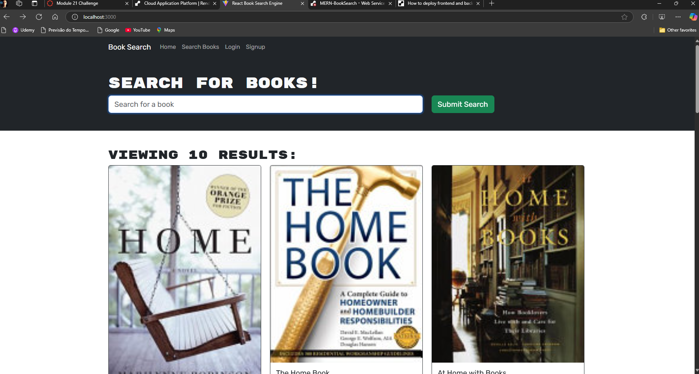
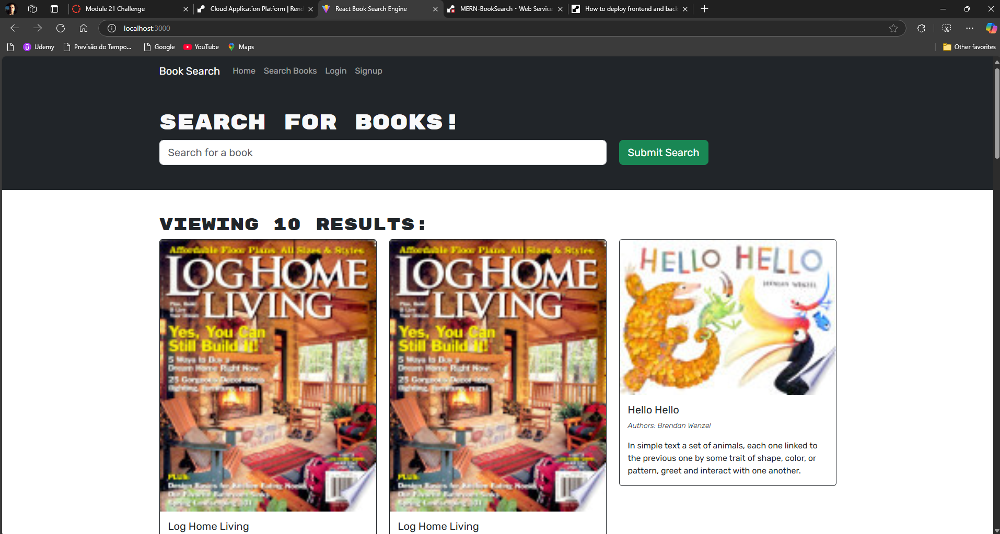
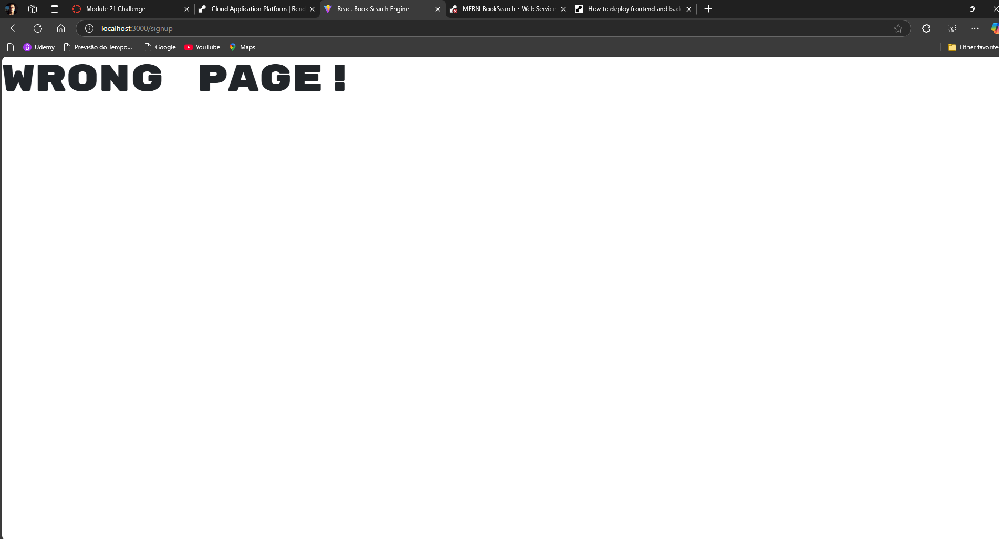

## MERN-Book Search
**Description**
This is a React-based web application that allows users to search for books using the Google Books API. Users can log in, sign up, save their favorite books, and view their saved books. I had trouble on this project making the navbar work correctly, when you click the buttons it goes to a page saying Wrong Page, and because of the erros I wasnt able to deploy the application. 

## Features
User Authentication: Users can register, log in, and log out.
Book Search: Search for books by title, author, or keyword using the Google Books API.
Save Books: Save books to a personal list to access later.
Responsive Design: Built with React Bootstrap for a mobile-friendly interface.
## Technologies Used
**Frontend**
React
React Router
Apollo Client (for GraphQL)
Bootstrap (for styling)
**Backend**
API: Google Books API for fetching book data

**Prerequisites**
Node.js and npm installed on your machine.
**Installation**
Clone the repository:
git clone https://github.com/LuccaBertoldi/MERN-BookSearch
cd book-search-app

Install dependencies:
npm install

Set up your Apollo Client:
Create an apolloClient.js file and configure it to connect to your GraphQL endpoint.

Run the application:
npm start
Your application will be available at http://localhost:3000.

## Usage
Login/Signup: Navigate to the login or signup pages to create an account or log in.
Search Books: Use the search bar to find books. You can save any book by clicking the "Save this Book!" button.
View Saved Books: Access your saved books by navigating to the "Saved Books" page.

## License
This project is licensed under the MIT License. See the LICENSE file for details.

## Screenshots

